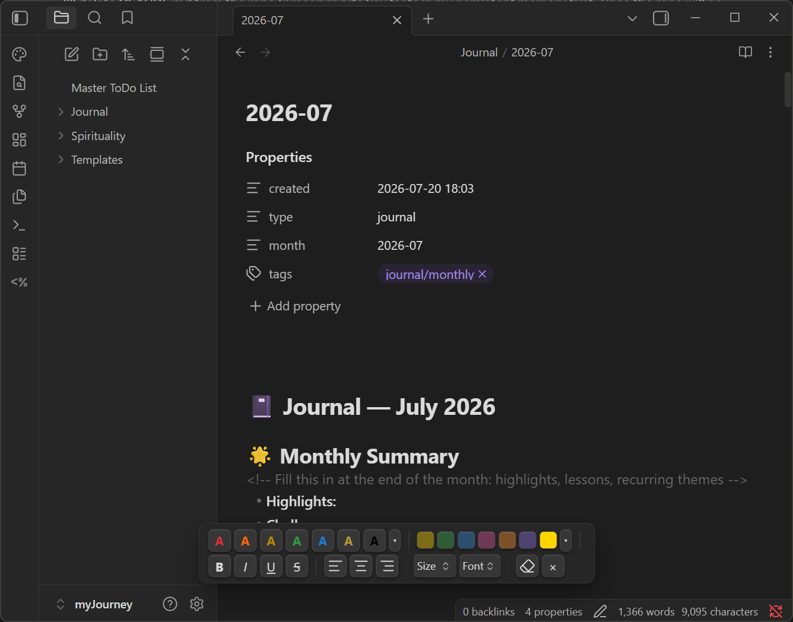
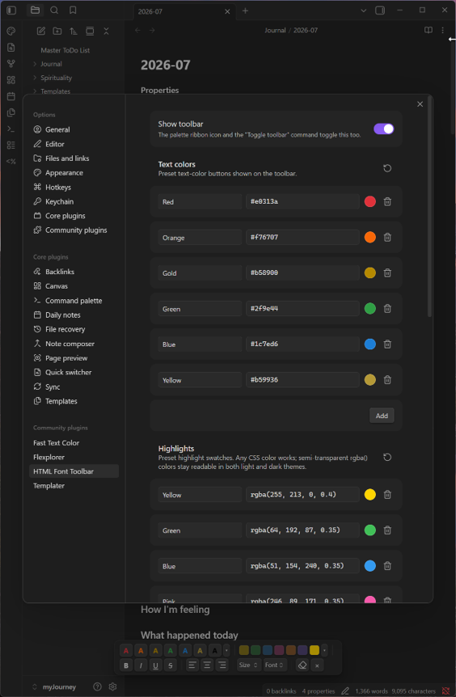
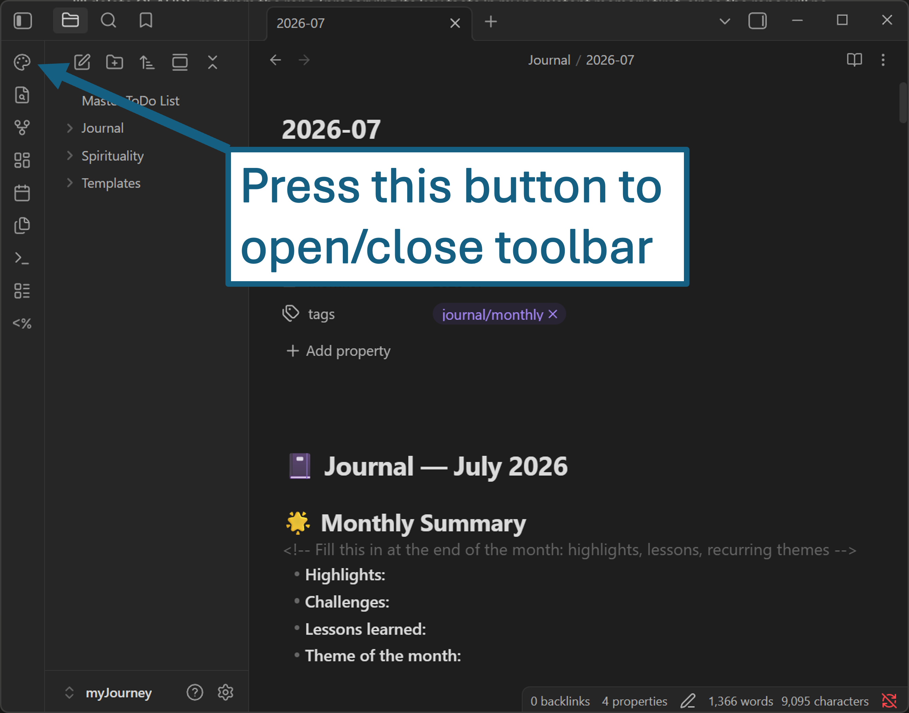

# HTML Font Toolbar

An Obsidian plugin that gives you a floating, Word-like formatting toolbar — but with a twist that makes it different from every other formatting plugin: **everything it produces is one clean inline HTML span**.

## Why another formatting plugin?

Markdown formatting (`**bold**`, `==highlight==`) and HTML styling (``) don't nest predictably. Mix plugins that use different syntaxes and you get conflicts: a highlight that locks the font color, bold that can't be colored, nested tags that break each other.

HTML Font Toolbar avoids the whole problem by staying in one layer:

- Select a word → click red → click yellow highlight → click Large → click **B**
- Result: `word`
- **One span.** Never nested wrappers. Click again to change or toggle any property — the plugin finds the existing span (even when Live Preview hides the markup) and edits it in place. It even repairs pre-existing nested spans.

Because the output is plain inline HTML, notes render identically even if the plugin is later removed.

## Features

- **Text color** — 6 theme-safe presets + a persistent custom color slot with picker
- **Highlight** — 6 semi-transparent presets that work in light *and* dark themes + custom slot
- **Bold / Italic / Underline / Strikethrough** — as span styles, so they merge and toggle
- **Font size** — Small to XXL (relative `em` units, scale with your theme)
- **Font family** — serif / mono / handwriting presets
- **Alignment (left / center / right)** — context-aware:
  - in a paragraph: aligns the paragraph
  - in a table with just a cursor: sets markdown's native *column* alignment (`:---:`)
  - in a table with a selection: aligns just that fragment inside the cell
- **Partial restyling** — select a word inside an already-styled sentence and style (or un-style) just that word: the span splits into clean sibling spans, still never nested, and re-merges when pieces become identical again
- **Clear formatting** — strips all HTML from the selection; click inside a styled word is enough, or select part of a styled run to clear just that part
- **Cursor-friendly** — after the first styling, clicking anywhere inside a styled word is enough to restyle it; no re-selecting
- **Fully customizable** — a settings tab lets you add, rename, recolor, or remove every preset (text colors, highlights, sizes, fonts), with one-click restore of the defaults
- Toolbar toggles via ribbon icon, command palette, or assignable hotkey; groups wrap responsively without splitting

## Customization

Every preset on the toolbar is editable in the plugin's settings tab: rename, recolor, remove, or add text colors, highlights, font sizes, and fonts. Each section has a one-click restore-defaults button. Changes apply to the toolbar immediately.

Color values accept any CSS color — hex like `#ffd500` or `rgba(255, 213, 0, 0.4)`, where the fourth rgba number is opacity (0 = transparent, 1 = opaque). The two formats are interchangeable: `#ffd500` is `rgba(255, 213, 0, 1)` with the three channels written in hex. As a rule of thumb, use opaque hex for text colors (semi-transparent text looks washed out) and semi-transparent rgba for highlights (so they stay readable in both light and dark themes).

## Installation

**From Obsidian (once accepted in the community directory):** Settings → Community plugins → Browse → "HTML Font Toolbar".

**Manual:** download `main.js`, `manifest.json`, `styles.css` from the [latest release](../../releases/latest) into `<vault>/.obsidian/plugins/html-font-toolbar/`, then enable the plugin in Settings → Community plugins.

## Usage

1. Click the palette icon in the left ribbon (or run "Toggle toolbar") to show/hide the toolbar.

   
2. Select text (or click inside an already-styled word) and press a button.
3. Stack as many properties as you like — they merge into a single span.
4. The eraser button removes all styling from the selection or the styled word under the cursor.

## Support

If this plugin is useful to you, consider supporting development:

Made by [Charette AI Group](https://charette-ai-group.github.io/web/).

## License

[MIT](LICENSE) © 2026 Charette AI Group, LLC
