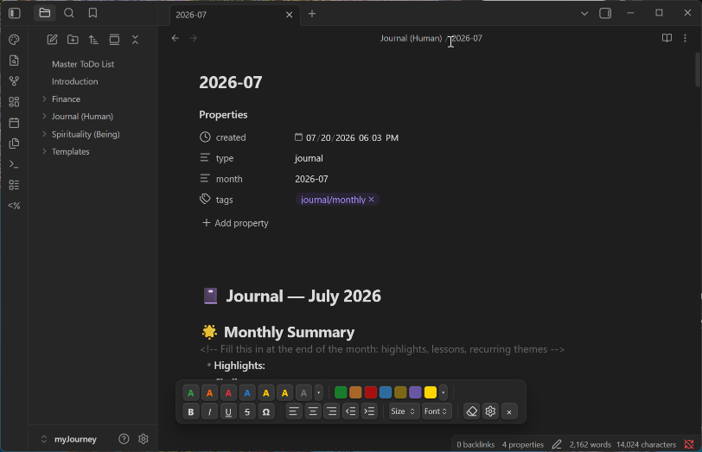
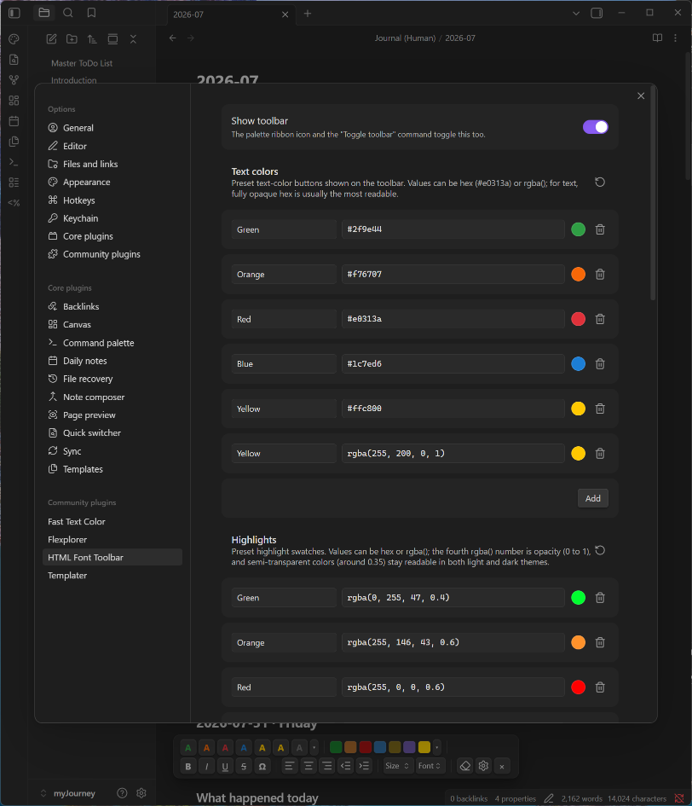
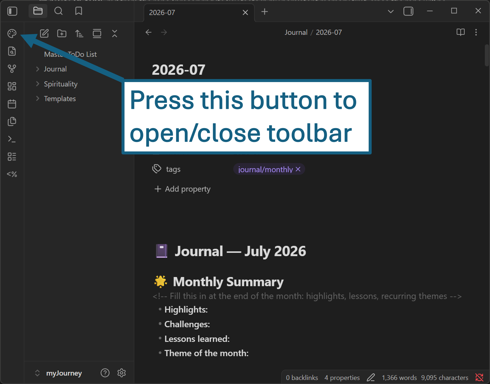

# HTML Font Toolbar

An Obsidian plugin that gives you a floating, Word-like formatting toolbar — but with a twist that makes it different from every other formatting plugin: **everything it produces is one clean inline HTML span**.

## Sister plugins

**HTML Font Toolbar** and **[HTML Table Toolbar](https://github.com/Charette-AI-Group/html-table-toolbar)** are sister plugins, built by the same author to the same house style and designed to work side by side. Neither depends on the other and neither imports the other's code — **install either one alone and it works completely.**

Install both and they coexist deliberately rather than by accident:

- **They stack instead of overlapping.** The table strip measures this toolbar and sits above it, reacting the moment this one is enabled, disabled, hidden, shown or re-wrapped by a narrower window. Nothing needs configuring.
- **They divide the work cleanly.** Font formatting is universal, so this toolbar is always available — including inside table cells, where bolding a header row is a frequent need. Table controls are contextual and only act when the cursor is in an HTML table.
- **They never fight over CSS.** Every class here is namespaced `hft-`, every class there is `tt-`.

Where this plugin styles text, the table plugin builds real `<table>` markup — merged cells, per-cell shading, per-row and per-column borders, and table centring, none of which Markdown pipe tables can do.

## Why another formatting plugin?

Markdown formatting (`**bold**`, `==highlight==`) and HTML styling (``) don't nest predictably. Mix plugins that use different syntaxes and you get conflicts: a highlight that locks the font color, bold that can't be colored, nested tags that break each other.

HTML Font Toolbar avoids the whole problem by staying in one layer:

- Select a word → click red → click yellow highlight → click Large → click **B**
- Result: `word`
- **One span.** Never nested wrappers. Click again to change or toggle any property — the plugin finds the existing span (even when Live Preview hides the markup) and edits it in place. It even repairs pre-existing nested spans.

Because the output is plain inline HTML, notes render identically even if the plugin is later removed.

## Features

- **Text color** — 6 theme-safe presets + a persistent custom color slot with picker; click the same color again to remove it
- **Highlight** — 6 semi-transparent presets that work in light *and* dark themes + custom slot; click the same highlight again to remove it
- **Bold / Italic / Underline / Strikethrough** — as span styles, so they merge and toggle
- **Symbol picker** — the Ω button opens a searchable character picker (math, Greek, arrows, punctuation, currency, marks) with a recently-used row. Characters insert at the cursor and inherit whatever styling surrounds them
- **Font size** — Small to XXL (relative `em` units, scale with your theme)
- **Font family** — serif / mono / handwriting presets
- **Alignment (left / center / right)** — wrapped in a `` rather than a `
`/`
`, which would make Obsidian treat the whole paragraph as raw HTML (lines wrapped by older versions migrate automatically the next time you touch them). Context-aware:
  - in a paragraph: aligns the paragraph
  - in a table with just a cursor: sets markdown's native *column* alignment (`:---:`)
  - in a table with a selection: aligns just that fragment inside the cell
  - on an image embed (`![[image.png]]` alone on a line): sets the alignment as an alias keyword (`![[image.png|center|300]]`) that the plugin's CSS aligns in both Live Preview and Reading mode — the image keeps rendering natively
- **Indent / outdent** — paragraph indentation in 2em steps; press again to deepen, and the outdent button walks it back. Indentation and alignment share a single wrapper, so they combine cleanly
- **Partial restyling** — select any stretch of an already-styled sentence, even across differently-styled parts, and style (or un-style) exactly that stretch: spans split into clean siblings, still never nested, and re-merge when pieces become identical again
- **Link-safe styling** — markdown links and embeds inside a styled selection are emitted *outside* the spans, so they keep working as links (whole-line alignment can't do this — see [Known limitations](#known-limitations))
- **Clear formatting** — strips all HTML from the selection; click inside a styled word is enough, or select part of a styled run to clear just that part
- **Cursor-friendly** — after the first styling, clicking anywhere inside styled text is enough to restyle it; no re-selecting. A click targets the innermost styled unit under the cursor, an explicit selection targets exactly the selected stretch (see Usage)
- **Fully customizable** — a settings tab lets you add, rename, recolor, or remove every preset (text colors, highlights, sizes, fonts), with one-click restore of the defaults
- Toolbar toggles via ribbon icon, command palette, or assignable hotkey; groups wrap responsively without splitting

## Customization

Every preset on the toolbar is editable in the plugin's settings tab: rename, recolor, remove, or add text colors, highlights, font sizes, fonts, and symbol groups. Each section has a one-click restore-defaults button. Changes apply to the toolbar immediately.

Color values accept any CSS color — hex like `#ffd500` or `rgba(255, 213, 0, 0.4)`, where the fourth rgba number is opacity (0 = transparent, 1 = opaque). The two formats are interchangeable: `#ffd500` is `rgba(255, 213, 0, 1)` with the three channels written in hex. As a rule of thumb, use opaque hex for text colors (semi-transparent text looks washed out) and semi-transparent rgba for highlights (so they stay readable in both light and dark themes).

## Installation

**From Obsidian (recommended):** Settings → Community plugins → Browse → search for "HTML Font Toolbar" — or open it directly in the [community directory](https://obsidian.md/plugins?id=html-font-toolbar).

**Manual:** download `main.js`, `manifest.json`, `styles.css` from the [latest release](../../releases/latest) into `<vault>/.obsidian/plugins/html-font-toolbar/`, then enable the plugin in Settings → Community plugins.

## Usage

1. Click the palette icon in the left ribbon (or run "Toggle toolbar") to show/hide the toolbar.

   
2. Select text (or click inside an already-styled word) and press a button.
3. Stack as many properties as you like — they merge into a single span.
4. Every styling button toggles: pressing the color, highlight, or B/I/U/S you already have removes just that one property and leaves the rest intact. Pressing a *different* color replaces the current one.
5. The eraser button removes all styling at once from the selection or the styled word under the cursor.

### Selection vs. cursor click — what gets styled?

- **Highlight a selection** to style exactly that stretch and nothing more. This works inside an already-styled sentence (the span splits around your selection), and even across differently-styled parts — each part keeps its other styles.
- **Just click, no selection** to restyle an existing styled unit as a whole. The button applies to the innermost styled span under the cursor: clicking a styled word targets that word; clicking in the body of a fully-styled sentence targets the whole sentence. So if a click styles more than you intended, make an explicit selection instead — selection always wins on precision.
- Plain, never-styled text always needs a selection — with only a cursor there is nothing to expand to.

## Known limitations

Both of these come from Obsidian itself rather than the plugin, and neither has a workaround available to a plugin:

- **Editing view does not render markdown inside inline HTML.** Live Preview renders inline HTML *or* parses markdown, never both — a long-standing Obsidian limitation ([Live Preview: Support inline HTML elements](https://forum.obsidian.md/t/live-preview-support-inline-html-elements-like-span/62707), [links inside `<u>`](https://forum.obsidian.md/t/live-preview-doesnt-render-internal-links-inside-u/29589)). In practice: if you center or indent a line containing a `[[wikilink]]`, that link shows as raw text while you are in **Editing view**, and renders correctly in **Reading view**. The same applies to markdown syntax such as `**bold**` typed inside a styled span. No choice of wrapper tag avoids it — the wrapping itself is what disables the parser. It is also why styling a *selection* deliberately emits links outside the spans, which is possible for inline styling but not for whole-line alignment, where the wrapper has to enclose the entire line.
- **Image alignment depends on the plugin's CSS.** Aligning an image embed writes an alias keyword (`![[image.png|center|300]]`) that the plugin's stylesheet acts on, because wrapping an embed in HTML stops it rendering at all. If you uninstall the plugin, those images revert to left alignment. Everything else the plugin produces is plain inline HTML and keeps rendering without it.

## Support

If this plugin is useful to you, consider supporting development:

Made by [Charette AI Group](https://charette-ai-group.github.io/web/).

## License

[MIT](LICENSE) © 2026 Charette AI Group, LLC
